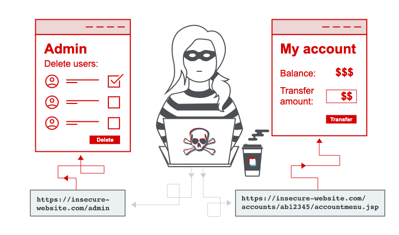

👾 [Inicio](https://rayanepimentel.github.io/InfoSec-iniciante/) | [Cronograma](https://rayanepimentel.github.io/InfoSec-iniciante/cronograma/) | [OWASP](https://rayanepimentel.github.io/InfoSec-iniciante/OWASP/owasp.html)

# OWASP Top 10

## O que é? 

É um relatório com os 10 riscos de segurança mais criticos, encontrados em aplicações web.

## Qual objetivo: 

Conscientizar os desenvolvedores sobre principais ameaças e fornecer diretrizes para proteger suas aplicações web contra as vulnerabilidade. 

# Lista top 10:2021 

1. [A01:2021 – Quebra de Controle de Acesso](#a012021-–-quebra-de-controle-de-acesso)

<!-- ## A01:2021 – modelo

### O que é? 

### Como acontece?

### Como mitigar?

### Cenários

### Lab

### Mais -->

## A01:2021 – Quebra de Controle de Acesso



### O que é? 

É quando um usuário é capaz de acessar recursos ou executar ações que não deveriam ser permitidas de acordo com a política de acesso definida. Isso pode resultar em exposição de informações sensíveis, manipulação indevida de dados ou execução de operações não autorizadas.

### Como acontece?

Pode ocorrer de várias maneiras:
- falhas na implementação de autenticação
- autorização inadequada
- falta de validação de permissões, violação do princípio de privilégio mínimo ou negação por padrão
- erros de configuração, exemplo CORS permite o acesso à API de origens não autorizadas / não confiáveis.

### Vulnerabilidades comuns

- Escalação horizontal de privilégios: ocorre quando um usuário pode executar uma ação ou acessar dados de outro usuário com o mesmo nível de permissões
    - Por exemplo, um aplicativo bancário permitirá que um usuário visualize transações e faça pagamentos de suas próprias contas, mas não das contas de qualquer outro usuário.
    - Se ocorrer essa vulnerabilidade, um usuário poderia visualizar a conta bancária de outro usuário.

- Escalação vertical de privilégios: ocorre quando um usuário pode executar uma ação ou acessar dados que requerem um nível de acesso além de sua função.
     - Por exemplo, um administrador pode modificar ou excluir a conta de qualquer usuário, enquanto um usuário comum não
    tem acesso a essas ações. Separação de tarefas e privilégios mínimos. 
    - Se ocorrer essa vulnerabilidade, um usuário se tornaria um usuário administrador.

### Como mitigar?

- Implementar um controle de acesso baseado em princípios de "privilégio mínimo" para garantir que os usuários tenham acesso apenas aos recursos necessários para suas funções.

- Assegure-se de que os controles de acesso sejam implementados de forma segura, considerando fatores como segurança de senhas, controles de recuperação de conta, controles de redefinição de senha, permissões de conta e gerenciamento de sessão.
    
- Utilize frameworks e bibliotecas projetados para lidar com autenticação e autorização de forma segura. Frameworks populares geralmente possuem recursos de segurança incorporados.

- Implemente o princípio do privilégio mínimo, concedendo aos usuários apenas as permissões necessárias para suas ações pretendidas.

- Realize testes e auditorias regulares nos mecanismos de controle de acesso para identificar e corrigir quaisquer vulnerabilidades.
   

### Cenários

- modificação de URLs para acessar páginas que devem ser restritas
- adulteração de cookies de sessão ou tokens para representar outros usuários e assumir funções privilegiadas por meio da manipulação de controles de acesso

Exemplo:

Um invasor simplesmente força a navegação para URLs de destino. Direitos de administrador são necessários para acessar a página de administrador.

```bash
https://example.com/app/getappInfo
https://example.com/app/admin_getappInfo
```

Se um usuário não autenticado pode acessar qualquer página, é uma falha. Se um usuário não administrador pode acessar a página de administração, isso é uma falha.

[Outros cenários](https://www.redteamsecure.com/terms-glossary/privilege-escalation-attacks)

### Lab

- [Lab: User role can be modified in user profile - Portswigger](https://portswigger.net/web-security/access-control/lab-user-role-can-be-modified-in-user-profile)

### Mais e referências
- Proactive Controls:
    - [C7 Enforce Access Controls](https://owasp.org/www-project-proactive-controls/v3/en/c7-enforce-access-controls)
- ASVS:
    - [V4 Access Control](https://github.com/OWASP/ASVS/blob/master/4.0/en/0x12-V4-Access-Control.md)
- Cheat Sheet
    - [Authorization Cheat Sheet](https://cheatsheetseries.owasp.org/cheatsheets/Authorization_Cheat_Sheet.html)
- Referências
    - [Crashtest](https://crashtest-security.com/broken-access-control-prevention/)
    - [Portswigger](https://portswigger.net/web-security/access-control)
<hr>