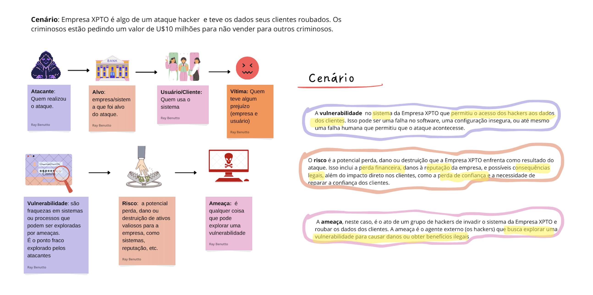

👾 [Inicio](https://rayanepimentel.github.io/InfoSec-iniciante/) | [Cronograma](https://rayanepimentel.github.io/InfoSec-iniciante/cronograma/) | [Cursos](https://rayanepimentel.github.io/InfoSec-iniciante/cursos/) | [Desenvolvimento Seguro](https://rayanepimentel.github.io/InfoSec-iniciante/cursos/Desenvolvimento-seguro/)

# Modelagem de ameaça

## Terminologias



### Exemplo de uma exploração de vulnerabilidade.

- Alvo: Empresa XPTO

**Reconhecimento**: 

O atacante identificou as principais tecnologias e versões do sistema em uso:

```ts
php -
laravel - 5.4.12
```
Com base nessa informação, ele consultou a "Lista Pública de Vulnerabilidades", o CWE (Common Weakness Enumeration) e buscou por vulnerabilidades específicas do Laravel na versão 5.4.12 ou posteriores.

### CWE

Organizações especializadas, como a Mitre.org e a Nist.gov, mantêm um catálogo de vulnerabilidades encontradas em tecnologias utilizadas globalmente. 
Para cada vulnerabilidade identificada, ela recebe um identificador único conhecido como CVE (Common Vulnerabilities and Exposures), ou em português, "Vulnerabilidades e Exposições Comuns".

### Ataque

O atacante descobriu um exploit público para uma vulnerabilidade específica do Laravel 5.4.12 e procedeu com o ataque. O exploit permitiu ao atacante explorar uma falha no sistema e executar ações maliciosas, como ganhar acesso não autorizado ou executar código arbitrário.

## Modelagem de ameaça - conceito


### Cenário de Aplicação

A equipe de design da empresa XPTO apresentou a nova interface para comentários no blog, conforme ilustrado abaixo:


Antes de avançar para a fase de desenvolvimento, a equipe de segurança realizará uma análise detalhada, conhecida como modelagem de ameaça, para identificar possíveis riscos e vulnerabilidades que a interface possa apresentar. 

Este processo é crucial, pois ajuda a evitar que problemas de segurança sejam descobertos após a implementação, o que poderia ser significativamente mais caro e demorado para corrigir.

### Como será feita essa análise?

Por exemplo:
- Campo "Choose file", qual tipo e tamanho de arquivo é aceito? O que acontece se enviar um arquivo .exe?
- Campo de "texto" é feito higinização dos dados? 


### Resumo

A modelagem de ameaça é uma estratégia essencial para o desenvolvimento seguro de aplicações, oferecendo uma abordagem proativa para a segurança. Ela permite a identificação e mitigação de riscos desde o início do processo de desenvolvimento, ajudando a evitar problemas de segurança caros e demorados para corrigir. Ao integrar a modelagem de ameaça no ciclo de vida do desenvolvimento, as organizações podem garantir a segurança de seus sistemas e proteger seus ativos digitais contra ameaças 


<br>
<hr>
<br>

[< Anterior](README.md) | [Próxima >](02-decomposicaoApp.md)
