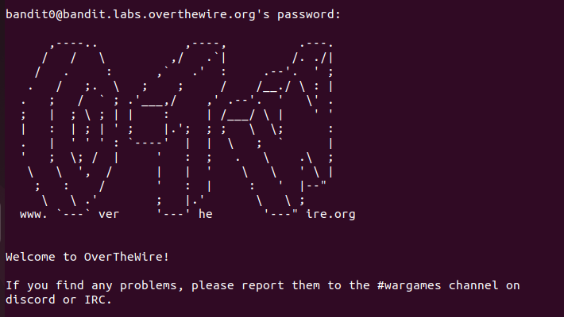

# Desafios "overthewire"

Link: [https://overthewire.org/wargames/bandit][def]

[def]: https://overthewire.org/wargames/bandit

## Level 00

[https://overthewire.org/wargames/bandit/bandit0.html](https://overthewire.org/wargames/bandit/bandit0.html)

Esse foi basicamente logar na máquina via ssh.

**Você sabe o que é "logar via ssh"? **

SSH é um protocolo, *Protocolo SSH (Secure Socket Shell) *, é um método utilizado para conectar remotamente permitindo a conexão entre cliente e servidor, de forma segura.

**O funcionamento do protocolo**

Na prática, o SSH fornece o mecanismo para que haja a autenticação desse usuário remoto, garantindo que essa pessoa tenha autorização para se comunicar com o servidor. Dessa maneira, é criada a conexão por meio do protocolo e as informações são transportadas nesse modelo de secure shell, com a criptografia que protege os dados.

Como acessar o protocolo SSH?
		
| | | |
|--|--|--|
|Tipo| Como| Exemplo |
|Com login e senha|Site |```$ ssh [username]@nomedosite.com.br```|
|Com login e senha| IP |```$ ssh [username]@[server IP address]``` |
|Usando chaves SSH |SSH key pair|```$ ssh-copy-id -i ~/.ssh/id_rsa.pub user@server``` |


```md
Se quiser ler o resumo completo sobre o protocolo SSH, clique no link a seguir. Leia as referencias que eu deixei também.
[Protocolo SSH](https://github.com/rayanepimentel/InfoSec-iniciante/blob/main/redes/redes-iniciante/parte1/1.protocolosDeRede.md#7-ssh)

```
### Desafio

Agora que sabemos o que é SSH e como se conectar, vamos logar!

O que diz o desafio: Logar via SSH <br>
Informações:

- Temos o host: `bandit.labs.overthewire.org`
- A porta (nesse desafio precisamos da porta): `2220`
- Nome do usuario: `bandit0`
- Senha: `bandit0`

Como vimos anteriormente podemos logar com "login e senha"

| | | |
|--|--|--|
|Tipo| Como| Exemplo |
|Com login e senha|Site |```$ ssh [username]@nomedosite.com.br```|

Mas temos uma informação: precisa ser na porta 2220. 

O SSH é normalmente executado na porta 22, mas há casos em que um servidor SSH pode estar configurado para escutar em uma porta diferente por motivos de segurança ou personalização.  

- Primeiro vamos saber o que significa essa porta. <br>
Encontrei essa explicação: [https://tcp-udp-ports.com/port-2220.htm](https://tcp-udp-ports.com/port-2220.htm) <br>

> A porta 2220 não possui um significado específico atribuído a ela. As portas são números de identificação atribuídos a diferentes serviços e protocolos de rede. As portas de 0 a 1023 são conhecidas como "portas bem conhecidas" e são atribuídas a serviços comuns, como o HTTP (porta 80) e o SSH (porta 22).

> No entanto, as portas acima de 1023 até 65535 são conhecidas como "portas dinâmicas" e podem ser usadas por aplicativos ou serviços personalizados, sem um significado padrão estabelecido. A porta 2220 é uma dessas portas dinâmicas e pode ser usada por um serviço específico ou aplicativo personalizado em um servidor.

 ~~configuração personalizada para aumentar a segurança ou evitar conflitos de porta.
~~
- Agora vamos saber como conectar via ssh na a porta 2220.<br>
No terminal digite `man ssh`, vai listar o manual do ssh.


Vimos que tem a opção `[-p port]`, que é usada para especificar a porta na qual o SSH (Secure Shell) deve se conectar ao servidor remoto.


Sabendo disso, então ficaria assim:

```bash
ssh -p 2220 bandit0@bandit.labs.overthewire.org 
```
- Vai aparecer uma pergunta: `yes`
- Digite a senha: `bandit0`




Login feito com sucesso \o/

[Para sair: `exit`]
