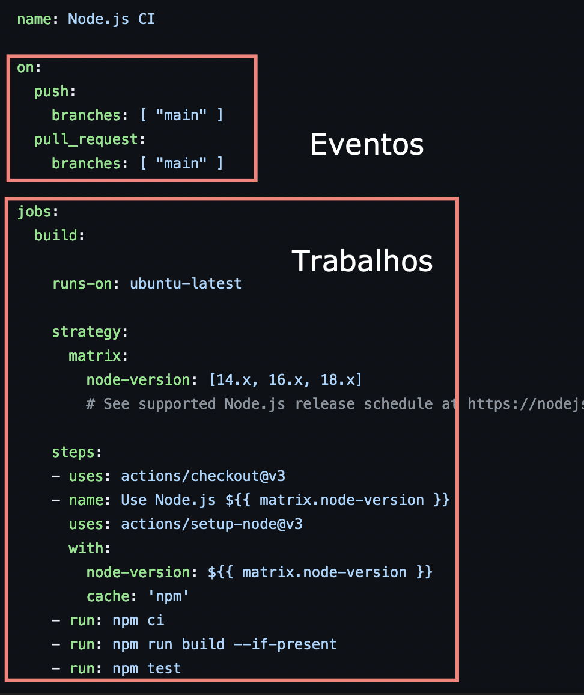
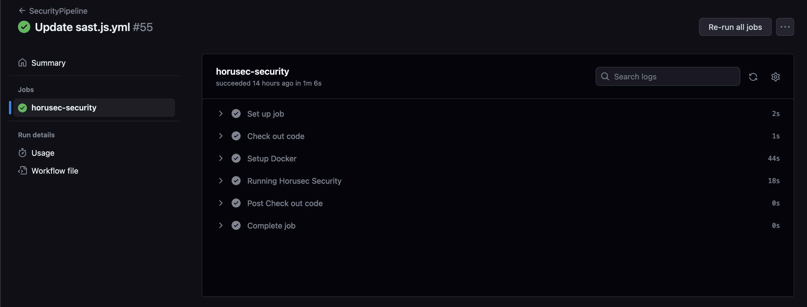

# Pipeline SAST

1. O que é pipeline
    1. https://www.redhat.com/pt-br/topics/devops/what-cicd-pipeline
    2. Um pipeline, no contexto do desenvolvimento de software, se refere a uma série de etapas ou estágios pelos quais as alterações de código passam antes de serem implantadas em produção. Cada estágio no pipeline representa uma tarefa específica, como construir o código, executar testes, análise de segurança e implantar em diferentes ambientes.
2. O que é SAST
    1. https://www.zup.com.br/blog/ferramentas-ssdlc
    2. SAST (Teste de Segurança Estático)  são técnicas de teste de segurança usadas em um pipeline de CI/CD. O SAST analisa o código-fonte em busca de vulnerabilidades conhecidas e práticas inseguras. Esses testes de segurança ajudam a identificar e corrigir problemas de segurança antes que o software seja implantado em produção, garantindo que o aplicativo seja seguro e protegido contra ameaças.
3. Workflow:
    1. https://docs.github.com/en/actions/quickstart
    2. Um workflow se refere à sequência de etapas ou tarefas que precisam ser realizadas para concluir um processo ou projeto específico. No desenvolvimento de software, um workflow geralmente inclui tarefas como codificação, teste, revisão e implantação.
    3. Ele é definido a partir de um arquivo YAML dentro da pasta .github/workflows
4. Sast usando no exemplo: 
    1. https://github.com/marketplace/actions/horusec


## Implementação:

### Instalação Horusec no projeto

A primeira etapa é criar o arquivo “horusec-config.json”. Para criar você precisa seguir a documentação.

Documentação: https://docs.horusec.io/docs/pt-br/cli/installation/

Depois faça o commit do arquivo.

### Github Actions

GitHub Actions ajuda a automatizar tarefas dentro de seu ciclo de vida de desenvolvimento de software https://docs.github.com/pt/actions

No seu projeto no github, vá em "Actions" e clique em "set up a workflow yourself" ou procure por "Simple workflow"

Irá abrir um arquivo yaml. 


`Antes disso vamos entender um pouco sobre esse workflow`

Como vimos o workflow é um arquivo YAML. Vamos entender um pouco sobre esse arquivo.

**Eventos**: É uma atividade que aciona um fluxo de trabalho. Exemplo, sempre que fizer push, ou quando tiver uma solicitação de PR.

**Trabalhos**: Um trabalho é uma unidade de trabalho que precisa ser executada em resposta a um evento. Pode ser uma tarefa simples, como processar um arquivo de dados, ou um processo mais complexo, como executar um fluxo de trabalho completo.

Exemplo:



Eventos: O Evento sempre é acionando quando ocorrer um push  para o branch “main” ou quando uma tiver uma solicitação de Pull request para o branch “main”.

Trabalhos: 
- Jobs: é o nome do trabalho, que nesse exemplo é “build”
- Runs-on: indica que o trabalho "build" será executado em uma máquina virtual com o sistema operacional Ubuntu mais recente. Isso significa que todas as etapas definidas dentro desse trabalho serão executadas nesse ambiente específico.
- Etapas (steps): As etapas (steps) são as unidades de trabalho individuais dentro de um trabalho (job). Cada etapa representa uma tarefa específica que precisa ser executada como parte do processo de construção, teste ou implantação do software.
    - Ao usar a palavra-chave "**uses**" em uma etapa, você pode especificar a ação a ser executada e, se necessário, fornecer argumentos adicionais para personalizar o comportamento da ação. Exemplo:
        - **uses: actions/checkout@v3**: Essa etapa usa a ação "checkout" para clonar o repositório do projeto. Essa etapa é responsável por obter o código-fonte do projeto para que ele possa ser usado nas etapas subsequentes.
    - "**name**" é usada para atribuir um nome a uma etapa (step) específica. O nome é opcional e serve para identificar e descrever a etapa de forma mais clara e legível.


## Configurar workflow

- Vamos criar os eventos:

```yaml
name: SecurityPipeline
on:
#eventos
  push:
    branches: [ "main" ]
  pull_request:
    branches: [ "main" ]
```

- Agora vamos trabalhos. Vamos usar a documentação do "Horusec": https://github.com/marketplace/actions/horusec

```yaml
jobs:
  horusec-security:
    name: horusec-security
    runs-on: ubuntu-latest
    steps:
    - name: Check out code
      uses: actions/checkout@v2
      with: # Necessário quando habilitado o autores de commit
        fetch-depth: 0
    - name: Running Horusec Security
      run: |
        curl -fsSL https://raw.githubusercontent.com/ZupIT/horusec/main/deployments/scripts/install.sh | bash -s latest
        horusec start -p="./"
```

- O nome do job será: horusec-security
- Irá rodar na maquina virtual Ubuntu
- Etapas:
    - name: o que será usado para identificar a ação
    - uses: será a ação, "actions/checkout@v2" para clocar o projeto
    - with: configurações adicionais para a ação "actions/checkout@v3"

No "Running Horusec Security", eu por essa documentação: https://docs.horusec.io/docs/pt-br/cli/installation/#github-actions e também adicionei mais uma etapa, como estou usando docker no meu projeto, tive que adicionar essa etapa.

- O primeiro comando utiliza o utilitário "curl" para fazer o download de um script de instalação do Horusec Security a partir do repositório GitHub da ZupIT. O script é executado usando o comando "bash" com o argumento "-s latest", que especifica a versão mais recente do Horusec Security a ser instalada.

- O segundo comando, "horusec start -p='./'", inicia a execução do Horusec Security no diretório atual ("./")

Meu YAML ficou assim:

```yaml
name: SecurityPipeline

on:
#eventos
  push:
    branches: [ "main" ]
  pull_request:
    branches: [ "main" ]

jobs:
#trabalhos
  horusec-security:
    name: horusec-security
    runs-on: ubuntu-latest
    steps:
    - name: Check out code
      uses: actions/checkout@v2
      with: # Necessário quando habilitado o autores de commit
        fetch-depth: 0
    - name: Setup Docker
      uses: docker-practice/actions-setup-docker@v1
    - name: Running Horusec Security
      run: |
        curl -fsSL https://raw.githubusercontent.com/ZupIT/horusec/main/deployments/scripts/install.sh | bash -s latest
        horusec start -p="./"
```

Agora é só fazer o commit e subir esse arquivo yaml para master.

- Actions > clique no workflow 



Ao clicar em "Running Horusec Security", você verá o analise.

