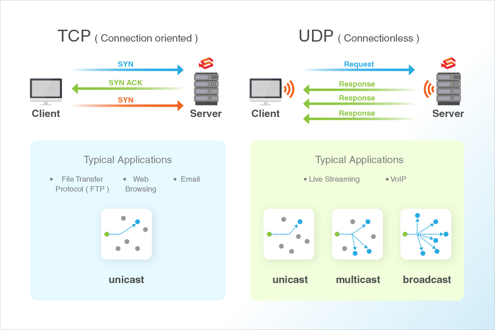
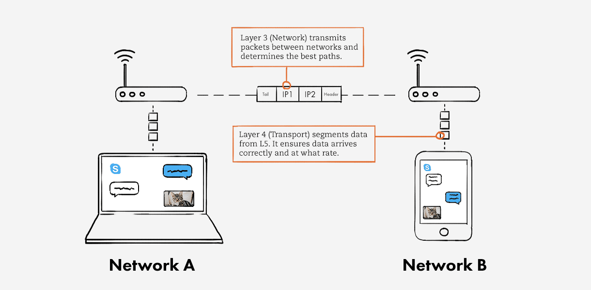
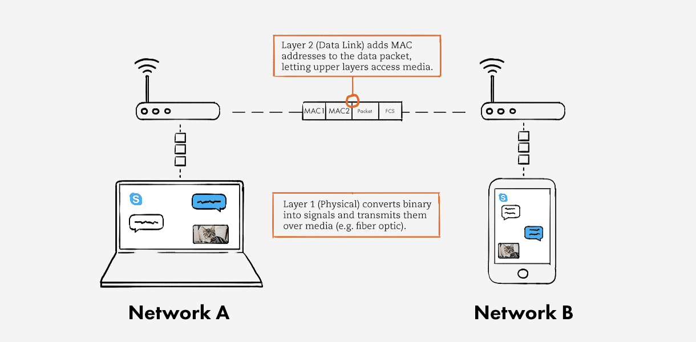

# Analogia modelo OSI → Enviando e-mail

**Cenário**: Gerente de TI enviando e-mail para a chefe de TI.

**7. Camada de aplicação**
Para a gerente enviar um e-mail, ela usará um provedor de e-mail(Outlook, Gmail, Protonmail, Thunderbird...). Nesse cenário, o cliente de e-mail usará o protocolo SMTP e o comando para informar ao computador como lidar com esses dados.

> Ele fornece a interface para o usuário informar ao computador como lidar com os dados.

**6. Apresentação**
Nessa camada é a criptografia e compactação de dados. Com criptografia, define o quão segura a comunicação deve acontecer para ir para próxima camada OSI. Por exemplo, nesta camada, você pode usar SSL (secure socket layer) para a criptografia dos dados. Com a compactação de dados nesta camada, pode-se melhorar o throughput dos dados nas camadas inferiores.

> A camada de apresentação é responsável pela tradução, criptografia e compactação dos dados.

**5. Sessão**
A camada de sessão é responsável por manter a conexão com a chefe de TI para entregar o e-mail corretamente.

Digamos que a gerente de TI abriu dois sites além do provedor de e-mail, um para ouvir música e outra para fazer compras. A camada de sessão é encarregada de manter todas essas conexões ativas, gerenciá-las e encerrá-las.

**5.Camada de transporte**
A camada de transporte decidirá a confiabilidade e o controle de fluxo. Neste, os dados de e-mail da gerente de TI serão divididos em segmentos para serem transmitidos. Aqui, é necessário selecionar se isso será transmitido como pacotes **TCP**(favorece a qualidade dos dados em detrimento da velocidade) ou pacotes **UDP**(favorece a velocidade em detrimento da qualidade dos dados).

Cada segmento, ou unidade de dados, possui um número de porta de origem e destino, bem como um número de sequência. O número da porta garante que o segmento alcance o aplicativo correto. O número de sequência garante que os segmentos cheguem na ordem correta.

Você pode pensar tbm na camada de transporte como controle de qualidade. Pacotes suspeitos não passarão por um firewall.

**3. Camada de rede**
Nessa camada definirá as rotas de origem e destiono, como o pacote sai do computador da gerente de TI para o computador da chefe de TI. Ele adiciona o endereço IP do remetente(origem) e o endereço IP do destinatário(destiono) ao pacote de dados. Agora cada pacote de dados sabe para onde deve ir.

>A camada 3 também determina os melhores caminhos para entrega de dados.

**2. Camada de enlace de dados**
Como sabemos na camada de rede, o pacote foi modificado com o endereço IP do remetente(origem) e o endereço IP do destinatário(destiono). Digamos que ao chegar na rede da chefe de TI, tem 5 dispositivos conectados nessa rede, como saberemos o pacote vai exatamente para o computador da chefe de TI? Como o endereçamento físico.

A camadade de enlace executa o endereçamento físico. Ele adiciona endereços [MAC](outrosConceitos.md#endereço-mac)(como se fosse um CPF da máquina) do remetente e do destinatário ao pacote de dados para formar uma unidade de dados chamada frame. A camada 2 permite que os frames sejam transportados via mídia local (por exemplo, fio de cobre, fibra ótica ou ar). Essa camada é incorporada como software na placa de interface de rede (NIC) do seu computador.

Ou seja com o endereço MAC ele pode facilmente identificar exatamente para qual dispositivo o pacote deve ser entregue.

**1. Camada física**
Agora os dados estão prontos para serem transmitidos para o lado do receptor. A camada física vai preparar frames de dados. Nesta camada física, o frame de dados será convertido em bits. Após a conversão, ele será enviado pela camada Física do dispositivo receptor(destino).

**Camada 2 e 1**:

